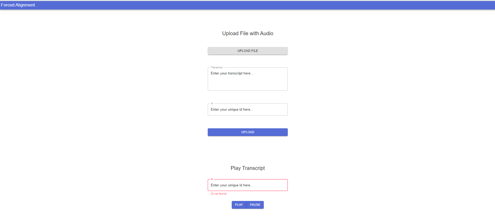

# Forced Audio Alignment

## Installation

### Source

- Install [Kaldi](https://www.eleanorchodroff.com/tutorial/kaldi/installation.html).
- Setup `KALDI_ROOT` in `path.sh`.
- Install [SLIRM](https://hovinh.github.io/blog/2016-04-22-install-srilm-ubuntu/) and ensure SLIRM binaries are in `PATH`.
- Download and build Kaldi Pretrained model using `build_model.sh`. This repo currently relies on Aspire Chain model. You can accordingly replace the model from [here](https://kaldi-asr.org/models.html) in `build_model.sh`.
- Install Python Dependencies using `requirements.txt`.
- Make the directories for storage.
  ```
  mkdir -p s3/text s3/audio s3/faligned
  ```
- Run the python server using `python server.py`

### Docker

- Build and run the provided dockerfile _(It can take a long time to build. Prebuilt images like one in packages may not work due to different platforms)_.

---

## Usage

- The server runs on port `5000` by default. _(Remember to bind it when using docker.)_
- Navigate to http://localhost:5000 to view the html form.
- Enter the quiz bowl text as well as the audio file and click on upload.
- Also add a unique id to reference this question.
- Upon successful response, enter the same id in the play audio input box and click on play. The text would appear as the audio is being spoken with the current word being highlighted.
- Unknown words would appear as [noise].
- You can check out the `.vtt` files generated for every audio as a universal `vtt` format subtitle file for easy usage.
- You can use the audio and transcipt in example folder for testing.



### Demo 

https://user-images.githubusercontent.com/53910337/116009515-cd238000-a637-11eb-98ab-dd02f89b0b3f.mp4

---

## Personal Notes

### Qanta & QB-Interface

- I was able to get qanta up and running as was able to fix some issues in the way.

  - Qanta Config Mismatch [here](https://piazza.com/class/kmqazoqjj5g3nj?cid=10)

  - NLTK Download [here](https://piazza.com/class/kmqazoqjj5g3nj?cid=11)

  - StopIteration error for torchtext in python ^3.7

- I achieved an accuracy of ~47% on DAN guesser. The notebook is available [here](https://gist.github.com/Mshivam2409/2b1bf7b87474011f8e4b4e2399f826d0) as a example installation of qanta.

- I tried intergrating with the interface, but I ran into several issues _(also due to abscence of a readme)_ while running the qanta & qb_interface, some were :

  - Twisted Web now only requires the path of folder i.e. `web` instead of HTML for [these lines](https://github.com/ihsgnef/qb_interface/blob/11371220a8a00f6543fcad35a75b075ca8d0dcf4/server.py#L765)

  - The db.sqlite downloaded using dataset.py has only 7 columns causing [this](https://github.com/ihsgnef/qb_interface/blob/11371220a8a00f6543fcad35a75b075ca8d0dcf4/db.py#L21) to fail. I started with an empty sqlite db which surpassed this error but I again ran into more.

- The work here is modular i.e. additional 3 routes for a web server and the frontend is built using ReactJS so there's only need to import additional scripts and add a `<div id=root>` tag for react render. So I beleive it could be easily integrated into qb_interface once the above issues are fixed.
